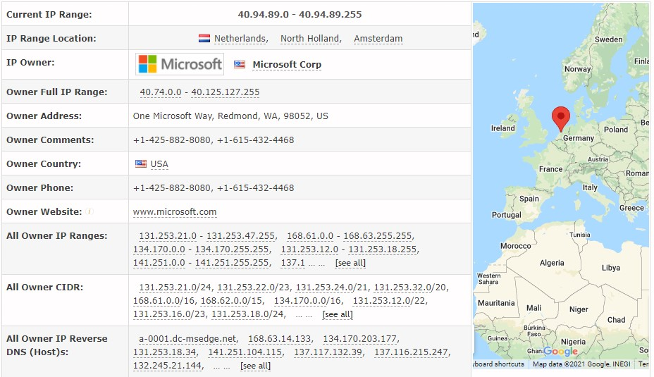

Here is a detective story about some data science forensics, and there is a villain too.

# Background

As a partner at a market research firm, I get involved in quite a lot of surveys. Some of them (such as voice of customer surveys/customer satisfaction) include sending a personal email invitation with "an invite link". 

Lately, we've started noticing a weird phenomenon: a lot of the links are opened (the email invitation link is clicked) but left unanswered. Also, we see a lot of cases where expect responses from a specific location, but see that originate all over Europe.

We started asking ourselves, are we witnessing an abuse of our surveys?


# Validating Respondents

One of my team members noticed some irregularities during our routine QA validations: responses were originating from unexpected remote locations all over Europe. A lot of duplicated IPs, as if a lot of people were suddenly using a VPN or something like that. Using a `whois` service I understood that the links are being opened by Microsoft owned IPs.



My first thought was that they started using some bot which examines the survey link within the email. Why exactly? at that point I hypothesized it was some kind of caching going on, probably for speed improvements (but that's not the deal).

Since no false information was being entered in these "partial surveys", no actual harm was done by this bot. Except that it's not entirely accurate, you see - in some surveys, the practice is to embed the first question of the survey within the invitation email. That way the first click of the recipient includes the answer to the first question, e.g., a "Net Promoters Score" (NPS) or general satisfaction question. It helps with response rates, but unfortunately the bot started clicking the links randomely and entering grabage data.


# A bot with random thoughts

Trying to analyze when the problem started affecting my clients, I created a chart similar to following, which compares partial answers (which are affected by the bot) versus complete answers (the bot doesn't complete the survey entirely, so complete answers are real people). I've added an illustration (I'm not using real data here so not to expose actual client's data).

```{r comparison, warning=FALSE, message=FALSE}
library(tidyverse)

responses <- read_csv("example_data.csv") %>% 
  mutate(response_time = factor(response_time, c("Before 2021-06-01", "After 2021-06-01")))

ggplot(responses, aes(x = type, fill = factor(rating))) + 
  geom_bar(position = "fill") + 
  facet_wrap(~response_time) + 
  scale_fill_brewer(palette = "RdYlGn") + 
  guides(fill = guide_legend("Rating")) + 
  theme_bw() + 
  scale_y_continuous(labels = scales::percent) + 
  ylab("Respondents [%]") + 
  xlab("") + 
  ggtitle("Distribution of complete vs. partial responses,\nbefore/after June 21")

```


