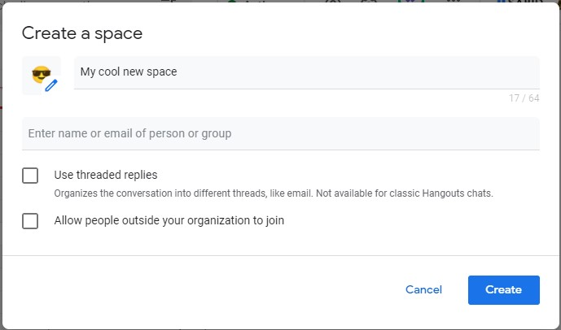

We use Google workspace as our email and document solution (i.e., the gmail solution for businesses). A few days ago I was chatting with one of my colleagues and noticed this feature called: "Manage webhooks" in the chat window. Apparently it's a quick hack to create your own chat bot, which can communicate with a google chat, a group chat, or a chat space (different variations of a chat room, basically).

What can you do with it? for us, we have a lot of automations going on, so when something goes wrong we usually use SMS text messaging to inform the owner of the process, or email to inform multiple recipients (i.e., with the `blastula` package). The google chat bot solution provides another channel through which automation malfunctions can be reported. It's really easy to set it up.

For now, this only exists in the Google workspace version (the "regular" private gmail doesn't have this feature turned on).

Without further ado...

## Creating the chat bot

Open a chat with a colleague or a "Space" (google's chat rooms), by clicking on the "+" sign next to the "Spaces" (on the bottom left of the screen, and then "create space". 


Give your space a name, an emoji, and add other persons (if you want others to receive these messages as well).



Once the new space opens up, click on the arrow next to the space's name (to open up the space menu), and then click on "Manage webhooks".


Give your incoming webhook a new name (e.g. "My R chatbot"), and click save. *Copy the link* which shows up:


Open up a new R script, and make sure you have the `httr` package installed (use `install.packages("httr")` if you don't have it). Use the following code to send messages to your new chat room from R:

```{r, eval=FALSE}

chat_url <- "<PASTE THE LINK YOU COPIED HERE>"

httr::POST(url = chat_url, 
           body = list(text = "Your text message goes *here*!"),
           encode = "json")

```

That's it! If you did everything right, you should see your message popping up in the chat space. You can install google chat mobile app if you want to receive the message to your mobile phone as well.

## Conclusion

This was a really quick solution for creating your chat bot using http requests and google chat. You can probably do something very similar with Slack and other similar solutions.

Currenly, I use this mostly for reporting on automated processes which run R scripts, and let me know about the automation results and errors if occurred. Obviously, you can a lot more with it. Let your imagination run wild and tell me what you ended up with!