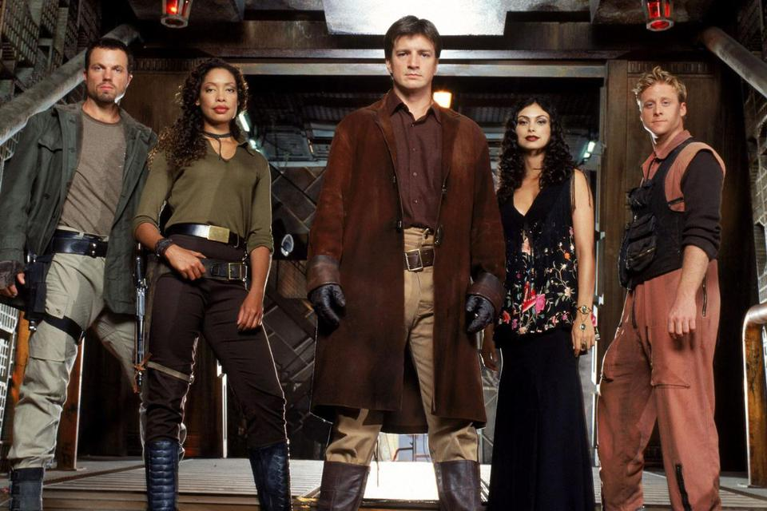
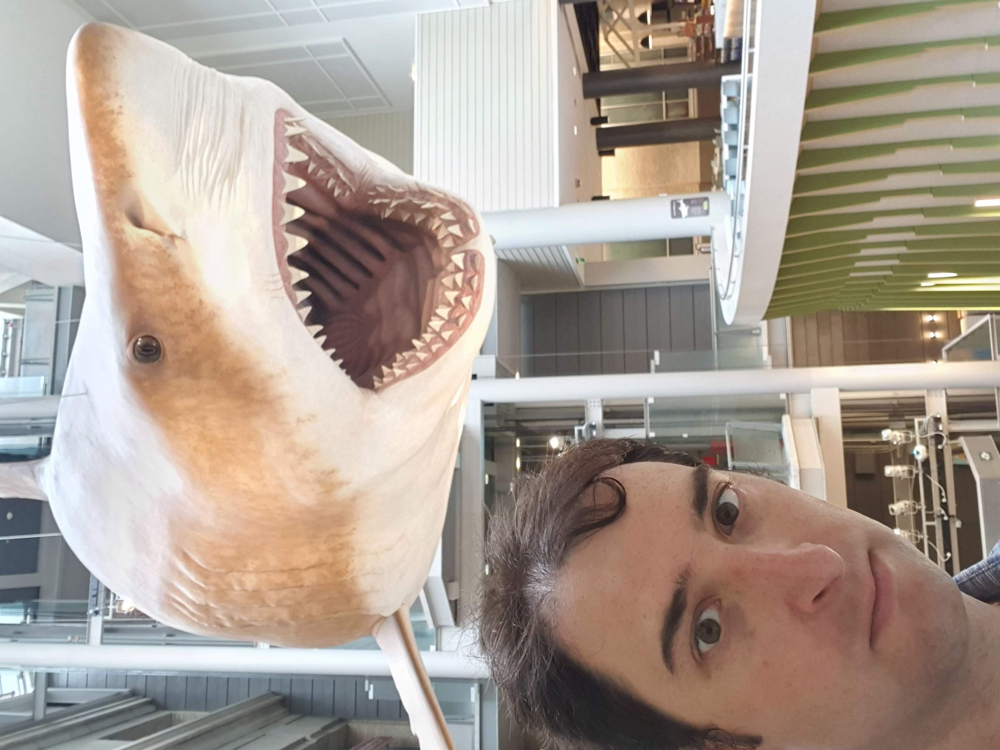

Last week I participated in the annual RStudio conference which took place in Washington DC.

As always, a great experience, with a lot of hex stickers.

{width="700"}

Here are some of my takeaways from the conference.

## RStudio extending its reach

For a long time now, RStudio has been developing products for R and Python (e.g., via the `reticulate` package which allows for using python from R, the support of the IDE for python scripts, and more).

To my understanding, RStudio has figured out that in order to grow significantly, it must put more emphasis on developing python products *directly*. This will allow it to sell its products in a "language agnostic" manner. Or using their words "a broader focus":

> We are embracing multi-lingual data science... we want to make scientific communication better for everyone.

This is reflected in multiple directions presented during the conference:

-   Re branding - RStudio is changing its name to posit. The new brand will sound more "natural" to non-useRs (or at least not cause aversion). See website [here](https://posit.co/), and scroll down - there is a video of Hadley Wickam explaninng the brand change.

-   Packages which are developed with R and python in mind, such is the `vetiver` package which allows deployment of `tidymodels`. See [here](https://www.tidyverse.org/blog/2022/06/announce-vetiver/).

-   The development of `quarto`, a program (command line interface actually), which generates documents. Those who are familiar will see that it is very similar to RMarkdown, however since it is a standalone software, it does not require R. Quarto support Jupyter notebooks as well as RMarkdown. It also has extensions to common IDEs such as VS Code. It can generate almost anything that RMarkdown can generate (and more coming in the future). Check out quarto [here](https://quarto.org/). Quatro is already integrated to RStudio IDE in its more recent versions.

-   The development of shiny for python. Joe Chang announced this in his very interesting (and emotional) keynote. Joe also told the story of how shiny came to be, how R "fits like a glove" to shiny (due to way function arguments are passed), and eventually surprised the audience with the fact that shiny for python is under way, and already in an Alpha version. The shinyapps.io service will also support shiny, there will be a shiny server for python, and additional surprises (e.g., shiny for python can be deployed without a server, using static html and by [translating the python code to WebAssembly](https://shiny.rstudio.com/py/docs/shinylive.html)). For more information abot shiny for python, read [here](https://shiny.rstudio.com/py/).

## The `tidymodels` workshop

I took the opportunity of the conference to join the `tidymodels` workshop.

So far I didn't do much work in `tidymodels`, but after the workshop I see that it does seem like a very good unifying framework. The workshop contained a lot of information and examples and was overwhelming to consume in just two days! Definitely a lot more to try out and learn independently.

Interesting thing to see in the workshop was the `vetiver` package for MLOps - it makes it easy to generate a model in production (a plumber api). It uses the `butcher` package to make the model slimmer, removing unnecessary data.

It will be interesting to try and upload a plumber api to an AWS Lambda function using Docker (the `vetiver` package is able to generate a dockerfile, see [here](https://rstudio.github.io/vetiver-r/reference/vetiver_write_docker.html) and [here](https://stackoverflow.com/questions/66770652/how-to-access-a-dockerized-r-image-trough-lambdaapi-gateway) for more information).

The `recipe` package is pretty rich in data engineering tools, a good reference is the following book on feature engineering and selection: [bookdown.org/max/FES](https://bookdown.org/max/FES).

I also liked the method in which `tidymodels` makes it really easy to tune your models by setting tuning on feature engineering parameters or on the model's parameters (package `tune`).

Some additional tools (extensions for `tidymodels`), from other talks, include:

-   Survival analysis from the `survival` package.

-   `tidyclust` for clustering (unsupervised learning).

## Quarto

Already mentioned above, I have already installed quarto and experienced with it. Since it is standalone, it is quicker than using RMarkdown. It also has some cool features like very easily switching from one format to another (e.g., from a document to a website).

The format is slowly gaining additional features, and most likely by 2023's end it will include almost all of the RMarkdown features.

## The `dbcooper` package

David Robinson showed the `dbcooper` package which can make a function out of database tables. Mainly aimed at reading from databases, and creates a nice interface.

## The `vetiver` package

Already mentioned above - a package around MLOps, can be very helpful to deploy models, though my next goal is to figure out how to take its docker image output and turn it into an AWS Lambda function.

It has a lot of features other than deployment such as reporting and documentation.

Check out here: <https://vetiver.rstudio.com>.

## Building a shiny app using a drag-and-drop interface

Mostly, when we build shiny apps, we build the interface programmatically, however a new package called `shinyuieditor` allows building the app with a nice drag-and-drop interface. Additional details [here](https://www.youtube.com/watch?v=Zac1qdaYNsY) and [here](https://rstudio.github.io/shinyuieditor/).

# To conclude

The conference had an abundance of innovations, methods, packages and more to learn from. I detailed just a few of the things I remember the most. I'm guessing that in the following days/weeks the posit team will upload all the talks to youtube (as they do after every conference), so that additional information can be consumed.

To end this post with a small anecdote, someone asked Joe Chang how did the inspiration for the name "shiny" came to be. Apparently, Joe watched the series "FireFly" by Joss Whedon in which the characters use the description "shiny" a lot, and the name kind of stuck.

{width="700"}

Since you made it to the end of this post, I might as well tell you that I also visited the Smithsonian natural history museum (I'm a fan of nature museums). A great museum, not part of conf, but a great visit opportunity. Here's a Megalogon about to eat my head.

{width="800"}
